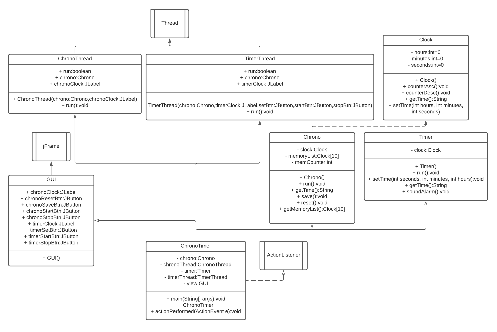
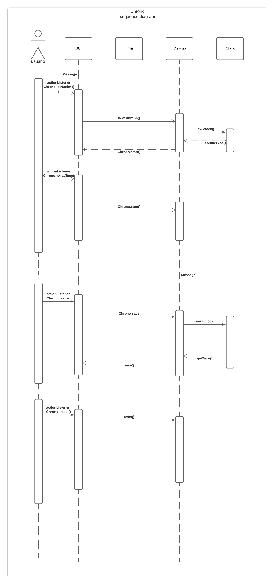
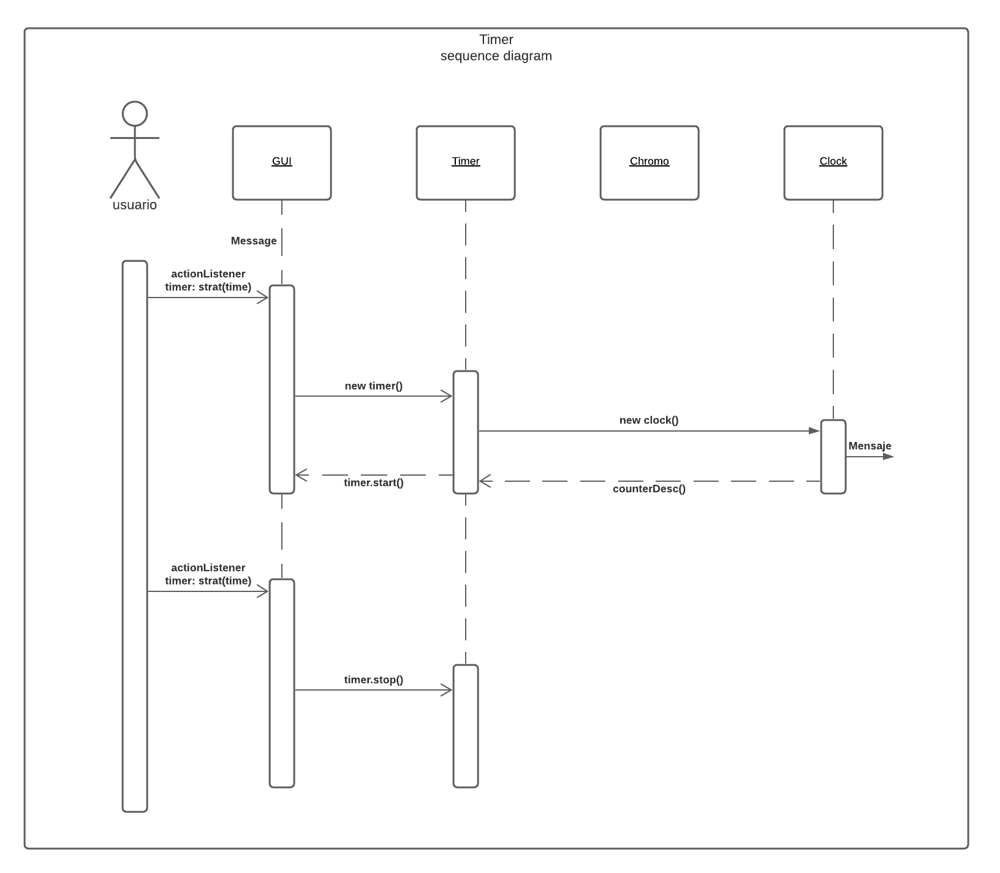
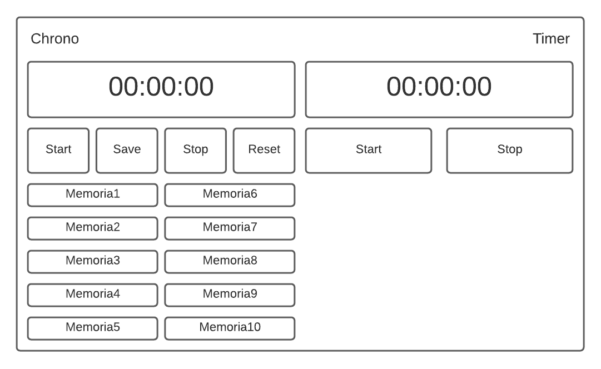
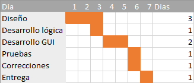

# Cronometro + Temporizador

## Jorge Galeano - 20172020060 && Juan Sebastian Moreno - 20152020097

## Especificación de requerimientos
| Módulo | Código | Requerimiento | Descripción | 
| ------------- | ------------- | ------------- | ------------- | 
| Cronómetro | A1 |	Iniciar | Permite al usuario iniciar el conteo de segundos, minutos y horas de forma ascendente | 
| Cronómetro | A2 |	Guardado en memória | Permite al usuario capturar y almacenar hasta 10 muestras de tiempo | 
| Cronómetro | A3 |	Detener | Permite al usuario detener el conteo de segundos, minutos y horas | 
| Cronómetro | A4 |	Reiniciar | Permite al usuario reiniciar el contador y borrar los datos almacenados | 
| Temporizador | B1 |	Ingresar tiempo | Permite al usuario establecer el tiempo inicial del temporizador | 
| Temporizador | B2 |	Iniciar | Permite al usuario Iniciar el conteo descendente desde el tiempo inicial establecido hasta 0 | 
| Temporizador | B3 |	Alarma | Permite al usuario escuchar un sonido cuando el contador llega a 0 | 

## Diagrama de clases

## Diagrama de secuencia

## Prototipo GUI

## Cronograma

